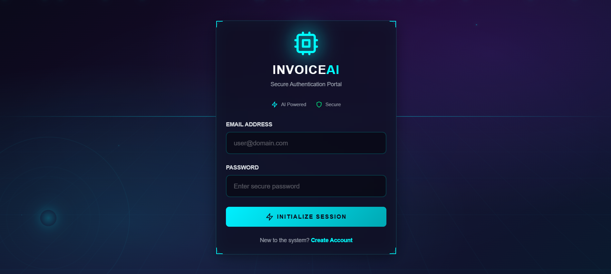
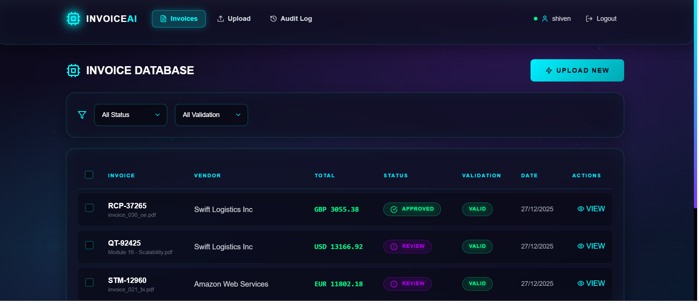
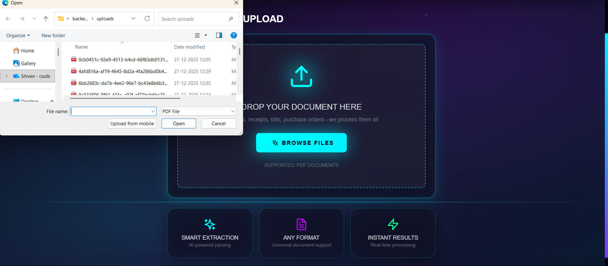
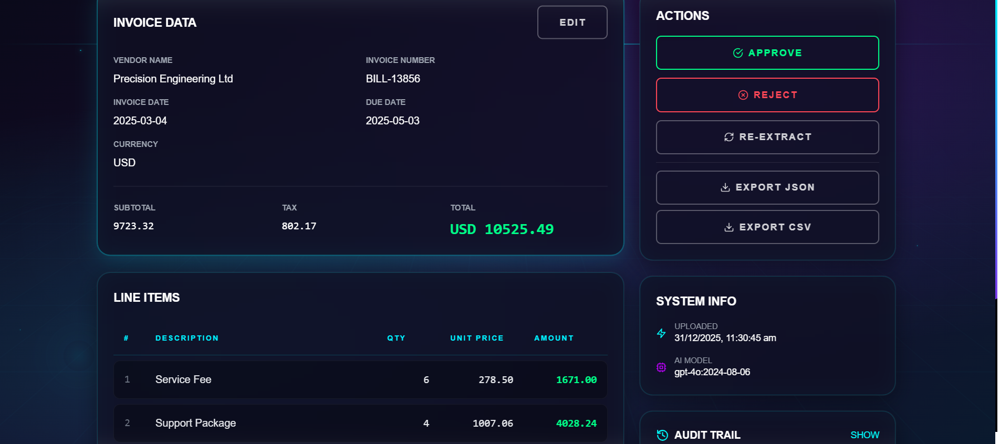
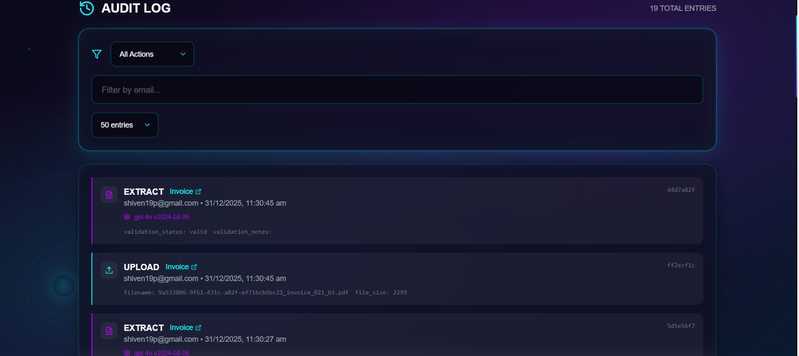

# Invoice-to-ERP Automation System

An AI-powered document processing system that automates invoice data extraction using GPT-4 Vision, with human-in-the-loop validation and ERP-ready exports.


## Screenshots

### Login Page


### Invoice Dashboard


### Document Upload


### Invoice Review & Edit


### Audit Trail


## Features

- **Smart AI Extraction** - Upload any PDF (invoices, receipts, bills, purchase orders) and GPT-4 Vision extracts structured data regardless of format
- **Human Review Workflow** - Review, edit, approve or reject extracted data before export
- **Automatic Validation** - Catches math errors (line items vs totals) with configurable tolerance
- **Complete Audit Trail** - Every action logged with user, timestamp, and before/after changes
- **ERP-Ready Export** - Download validated data as JSON or CSV for ERP import
- **Modern Cyberpunk UI** - Sleek glassmorphism design with animated 3D background
- **Secure Authentication** - JWT tokens with bcrypt password hashing

## Tech Stack

### Backend
- **FastAPI** - Modern async Python web framework
- **SQLAlchemy** - ORM with SQLite database
- **OpenAI GPT-4 Vision** - AI-powered document understanding
- **pdf2image + Pillow** - PDF to image conversion
- **Pydantic** - Request/response validation
- **python-jose + passlib** - JWT authentication

### Frontend
- **React 18** - Component-based UI
- **TypeScript** - Type-safe development
- **Vite** - Fast build tooling
- **TanStack Query** - Server state management
- **Tailwind CSS** - Utility-first styling
- **Lucide React** - Icon library

## Quick Start

### Prerequisites
- Python 3.10+
- Node.js 18+
- Poppler (for PDF processing)

```bash
# Windows (using Chocolatey)
choco install poppler -y

# macOS
brew install poppler

# Ubuntu/Debian
sudo apt-get install poppler-utils
```

### Installation

1. **Clone the repository**
```bash
git clone https://github.com/shivenpaudyal9/invoice-erp-automation.git
cd invoice-erp-automation
```

2. **Setup Backend**
```bash
cd backend
python -m venv venv
source venv/bin/activate  # Windows: venv\Scripts\activate
pip install -r requirements.txt
```

3. **Configure Environment**
```bash
cp .env.example .env
# Edit .env with your settings
```

4. **Setup Frontend**
```bash
cd ../frontend
npm install
```

5. **Run the Application**
```bash
# Terminal 1 - Backend
cd backend
python -m uvicorn app.main:app --reload

# Terminal 2 - Frontend
cd frontend
npm run dev
```

6. **Open Browser**
- Frontend: http://localhost:5173
- API Docs: http://localhost:8000/docs

## Environment Variables

Create a `.env` file in the `backend` directory:

```env
# OpenAI API (optional - uses mock mode if not set)
OPENAI_API_KEY=sk-your-key-here

# Database
DATABASE_URL=sqlite:///./invoices.db

# Authentication
SECRET_KEY=your-super-secret-key-change-in-production
ACCESS_TOKEN_EXPIRE_MINUTES=60

# File Upload
UPLOAD_DIR=./uploads

# Demo Mode (set to false for real AI extraction)
USE_MOCK_EXTRACTION=true
```

## Project Structure

```
invoice-erp-automation/
├── backend/
│   ├── app/
│   │   ├── models/         # SQLAlchemy database models
│   │   ├── routers/        # API route handlers
│   │   ├── schemas/        # Pydantic validation schemas
│   │   ├── services/       # Business logic (extraction, validation)
│   │   ├── auth.py         # JWT authentication
│   │   ├── config.py       # Environment configuration
│   │   ├── database.py     # Database connection
│   │   └── main.py         # FastAPI application
│   ├── uploads/            # Uploaded PDF storage
│   ├── requirements.txt
│   └── .env.example
├── frontend/
│   ├── src/
│   │   ├── components/     # React components
│   │   ├── context/        # Auth context provider
│   │   ├── services/       # API client
│   │   ├── types/          # TypeScript interfaces
│   │   ├── App.tsx
│   │   └── main.tsx
│   ├── package.json
│   └── vite.config.ts
├── docs/                   # Screenshots
├── start-demo.bat          # Windows quick start
├── stop-demo.bat           # Windows stop servers
└── README.md
```

## API Endpoints

### Authentication
| Method | Endpoint | Description |
|--------|----------|-------------|
| POST | `/api/auth/register` | Register new user |
| POST | `/api/auth/login` | Login, returns JWT |
| GET | `/api/auth/me` | Get current user |

### Invoices
| Method | Endpoint | Description |
|--------|----------|-------------|
| POST | `/api/invoices/upload` | Upload PDF, trigger extraction |
| GET | `/api/invoices` | List invoices with filters |
| GET | `/api/invoices/{id}` | Get invoice details |
| PUT | `/api/invoices/{id}` | Update invoice fields |
| POST | `/api/invoices/{id}/approve` | Approve invoice |
| POST | `/api/invoices/{id}/reject` | Reject invoice |
| POST | `/api/invoices/{id}/reextract` | Re-run AI extraction |

### Export
| Method | Endpoint | Description |
|--------|----------|-------------|
| GET | `/api/invoices/{id}/export/json` | Export as JSON |
| GET | `/api/invoices/{id}/export/csv` | Export as CSV |
| POST | `/api/export/batch` | Batch export multiple |

### Audit
| Method | Endpoint | Description |
|--------|----------|-------------|
| GET | `/api/invoices/{id}/audit` | Invoice audit trail |
| GET | `/api/audit` | Global audit log |

## Workflow

```
┌─────────┐    ┌───────────┐    ┌────────┐    ┌──────────┐
│ PENDING │───▶│ EXTRACTED │───▶│ REVIEW │───▶│ APPROVED │
└─────────┘    └───────────┘    └────────┘    └──────────┘
     │              │               │               │
     │              │               │               ▼
   Upload      AI Process      Human Review    ERP Export
                                    │
                                    ▼
                              ┌──────────┐
                              │ REJECTED │
                              └──────────┘
```

## Demo Mode

The application includes a demo mode with mock AI extraction for testing without OpenAI API costs. Mock mode generates realistic invoice data with varied vendors, amounts, and document types.

To switch to real AI extraction:
1. Set `USE_MOCK_EXTRACTION=false` in `.env`
2. Add your `OPENAI_API_KEY`
3. Restart the backend server

## Author

**Shiven Paudyal** - [GitHub](https://github.com/shivenpaudyal9)

## License

This project is licensed under the MIT License - see the [LICENSE](LICENSE) file for details.
